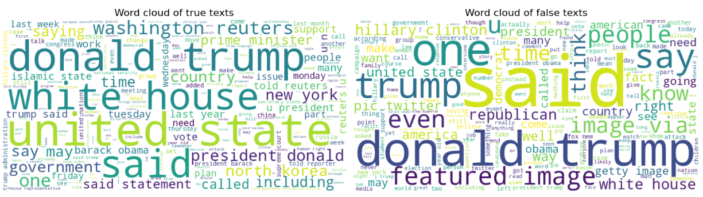
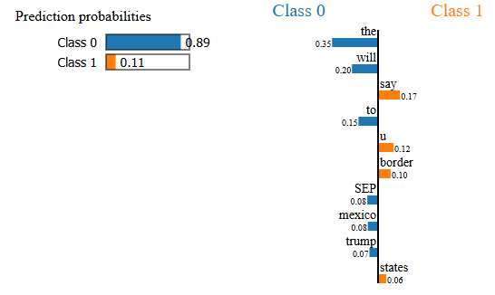

# Fake Text Classification

This project explores various machine learning and deep learning techniques to classify articles texts as truthfull or false.

---

## Project overview

Project explores binary text classification to determine the credibility of text. 
Uses:

- Logistic regression based on engineered features of both articles texts and titles.
- Random forest based on engineered features of both articles texts and titles.
- Transformer based model DistilBERT.

---

## Dataset description and preprocessing

Each text is paired with a title and a label indicating whether the text is true:1 or false:0. In the final cleaned set there are 55% true and 45% false cases.

- **Preprocessing**:
  - Text cleaning: lowercasing, non-letter symbols removing, stopword removal, masking, lemmatization and other.
  - Feature engineering: different symbols ratios, URLs ratios, average word length, stopword ratios and multiple others.

---

## Word cloud

---

## Models and results

### Logistic regression (Engineered features)
- **Features**: engineered features
- **Performance**: macro F1 score: 0.88, ROC-AUC: 0.95

### Random forest
- **Features**: engineered features.
- **Performance**: macro F1 score: 0.94, ROC-AUC: 0.99

### DistilBERT
- **Architecture**: transformer based model using feature extraction. People, organizations, and geographic location entities are masked to reduce bias.
- **Training**: model is used in a feature extraction setup where only the output layer is trained.
- **Loss function**: binary cross-entropy
- **Performance**: macro F1 score: 0.95, ROC-AUC: 0.99

---

## DistilBERT misclassification explained with LIME

---

## License

This project is licensed under the MIT License. See the LICENSE file for details.
